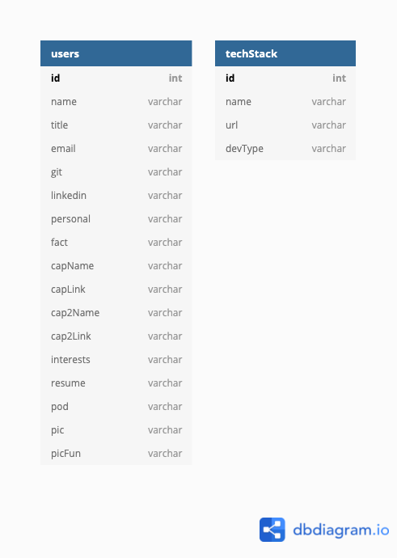
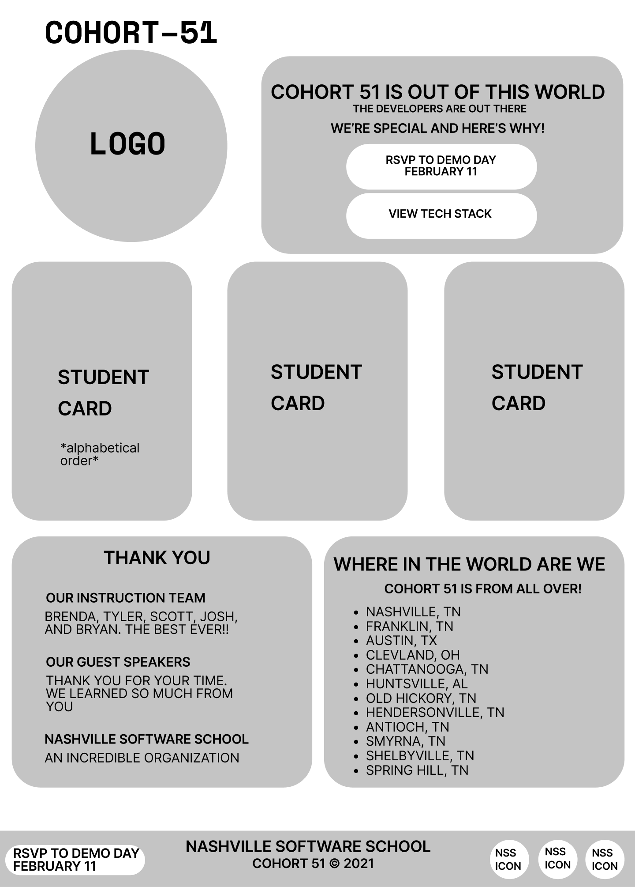

# Cohort 51, Front-End Web Designer/Developer Bootcamp, Nashville Software School

## How to Run Website
* [Click this link to visit the Cohort 51 Website - https://nss-day-cohort-51.github.io/](https://nss-day-cohort-51.github.io/)

## Challenge Statement - Cohort 51 Student Website

## User Data - Cohort 51 Student Website

## ERD - Cohort 51 Student Website

## WireFrame - Cohort 51 Student Website

## Text Style Guide - Cohort 51 Student Website

## Color Pallet Style Guide - Cohort 51 Student Website

## Logo Design - Cohort 51 Student Website

## Modal Layout MOCK-UP - Cohort 51 Student Website

## MOCK-UP - Cohort 51 Student Website

